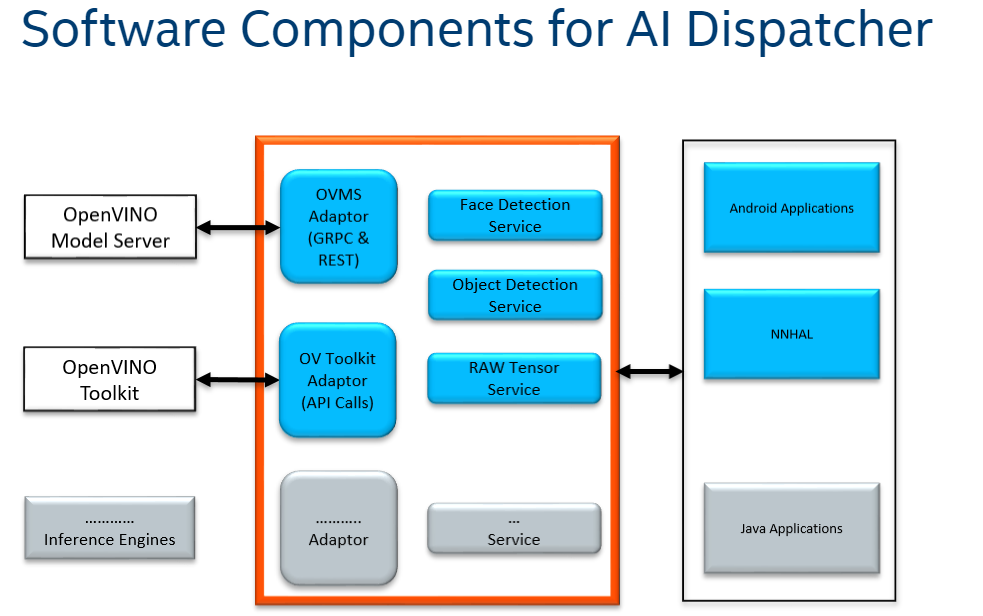

# AI Dispatcher

## 1. Introduction
AI Dispatcher is a reference solution that provide a list of service-implementations and adaptor-implementations to perform platform-agnostic AI-inference on the given input, using the available underlying Inference Engine.​


## 2. Major functionalities :​

- Accept inputs via gRPC​

- Perform required data conversions on the input​

- Use one of the adaptors** for inference​
    - OpenVino Toolkit(OVTK)

- Format the output and return the result​


## 3. Architecture
Note: OVMS is temporarily disabled in this release branch.
<p align="center">

</p>

## 4. Compile and Run 
### 4.1. Pre-requisites
Make sure whichever adaptor you want to use is pre-installed and running

- For openvino toolkit its recommeded to install version 2023.0 or latest

### 4.2. Steps to run

#### 4.2.1 General Setup Steps:
```bash
git clone https://github.com/intel-sandbox/ai-dispatcher.git
cd ai-dispatcher
export PYTHONPATH="$PWD"
python3 -m pip install -r client_requirements.txt
```

#### 4.2.2 Steps For Running Raw Tensor service
```bash
# generate proto file
cd services/rawTensor && python3 -m grpc_tools.protoc -I . --python_out=. --grpc_python_out=. *.proto
```

**To run  rawTensorservice with ovtk**
```bash
source <open_vino_install_path>/setupenv.sh

python3 rawTensor.py --unix_socket ~/ipc/ai.socket

## if you want to pass specific device to be used for inferencing use --device GPU.1 or CPU
```
